# DC Motor Modeling and Identification with dSPACE DS1104

MATLAB/Simulink and dSPACE ControlDesk project for identifying and validating a discrete-time DC motor model from experimental step-response data.

This project uses a DC motor with encoder feedback, an H-bridge driver, and a dSPACE DS1104 rapid-control-prototyping board. Step voltage experiments were used to estimate the motor parameters, validate the identified model in Simulink, and compare graphical and least-squares identification methods.

<p align="center">
  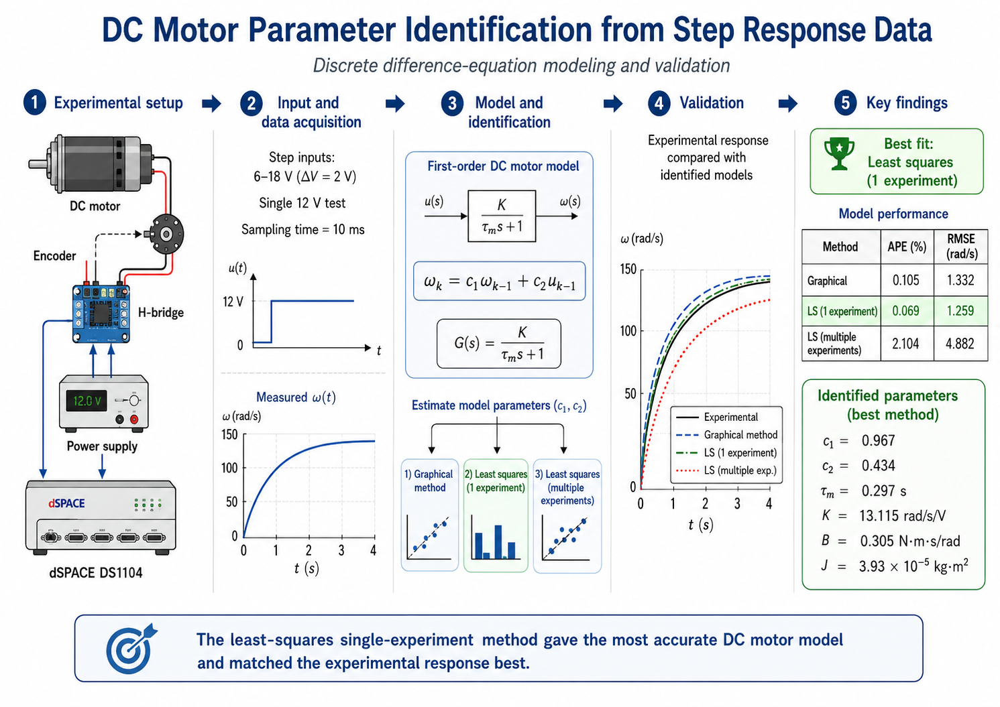
</p>

## Experiment

The motor was tested by applying step voltage inputs and recording angular velocity with a **10 ms** sampling time. The measured response was fitted to a discrete difference-equation model, then validated by comparing the simulated response against the experimental data.

The identification methods were:

- **Graphical method:** steady-state gain and 63% time-constant rule.
- **Least squares, one experiment:** model fitted from the 12 V step response.
- **Least squares, multiple experiments:** model fitted from 6 V to 18 V step tests in 2 V increments.

<table>
  <tr>
    <td align="center" width="33%">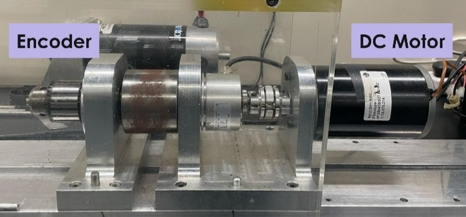<br><sub>DC motor and encoder</sub></td>
    <td align="center" width="33%">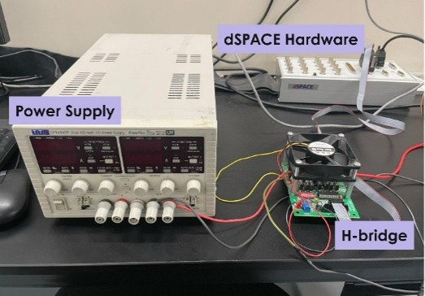<br><sub>Power supply, H-bridge, and dSPACE hardware</sub></td>
    <td align="center" width="33%">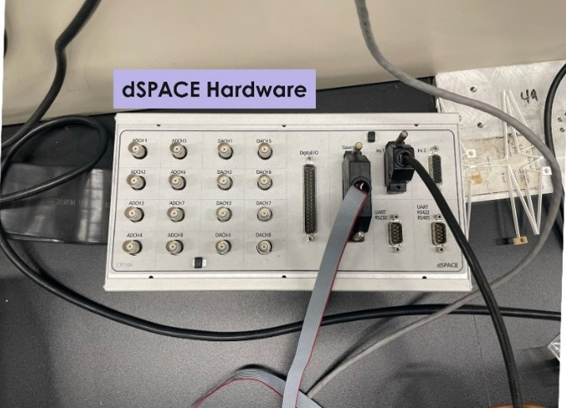<br><sub>dSPACE hardware close-up</sub></td>
  </tr>
</table>

## Modeling and Implementation

The DC motor was represented using a discrete transfer-function model and implemented as a difference equation. The estimated coefficients were used to compute the motor gain, time constant, viscous friction coefficient, and moment of inertia.

<table>
  <tr>
    <td align="center" width="50%">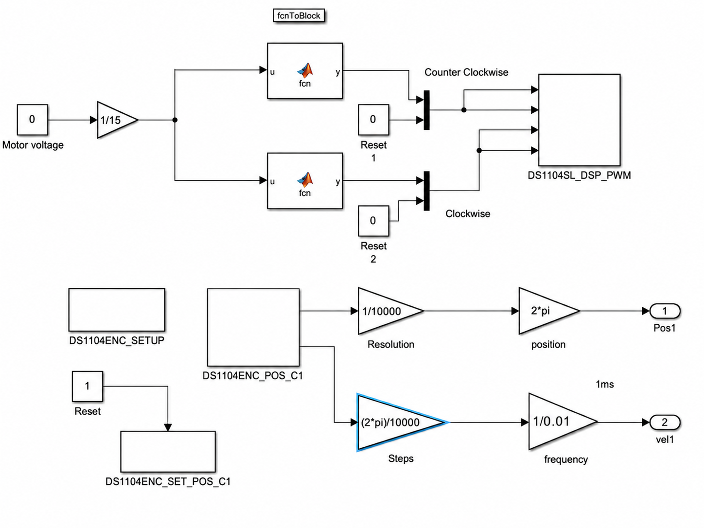<br><sub>System block diagram</sub></td>
    <td align="center" width="50%">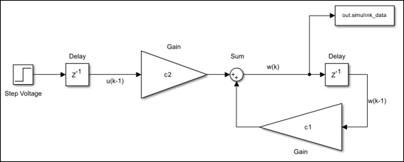<br><sub>Difference-equation Simulink model</sub></td>
  </tr>
  <tr>
    <td align="center" width="50%">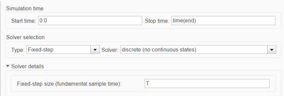<br><sub>Simulink model settings</sub></td>
    <td align="center" width="50%">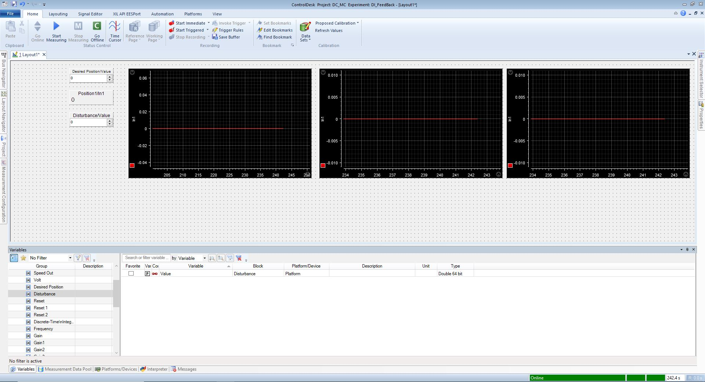<br><sub>dSPACE ControlDesk layout</sub></td>
  </tr>
</table>

## Results and Observations

All three identification methods captured the transient behavior of the motor. The **12 V single-experiment least-squares method** produced the best overall match to the experimental response, while the graphical method remained close and practical. The multiple-experiment least-squares method showed the largest steady-state deviation, likely because averaging across datasets introduced sensitivity to experiment-to-experiment variation.

| Method | c1 | c2 | tau_m (s) | K (rad/s/V) | B (N m s/rad) | J (kg m^2) | APE (%) | RMSE (rad/s) | Observation |
| --- | ---: | ---: | ---: | ---: | ---: | ---: | ---: | ---: | --- |
| Graphical | N/A | N/A | 0.305 | 13.138 | 0.304 | 4.04E-05 | 0.105 | 1.332 | Good simple estimate |
| Least squares, one experiment | 0.967 | 0.434 | 0.297 | 13.115 | 0.305 | 3.93E-05 | 0.069 | 1.259 | Best overall fit |
| Least squares, multiple experiments | 0.968 | 0.408 | 0.310 | 12.848 | 0.307 | 4.10E-05 | 2.104 | 4.882 | Underestimated steady-state response |

<table>
  <tr>
    <td align="center" width="50%">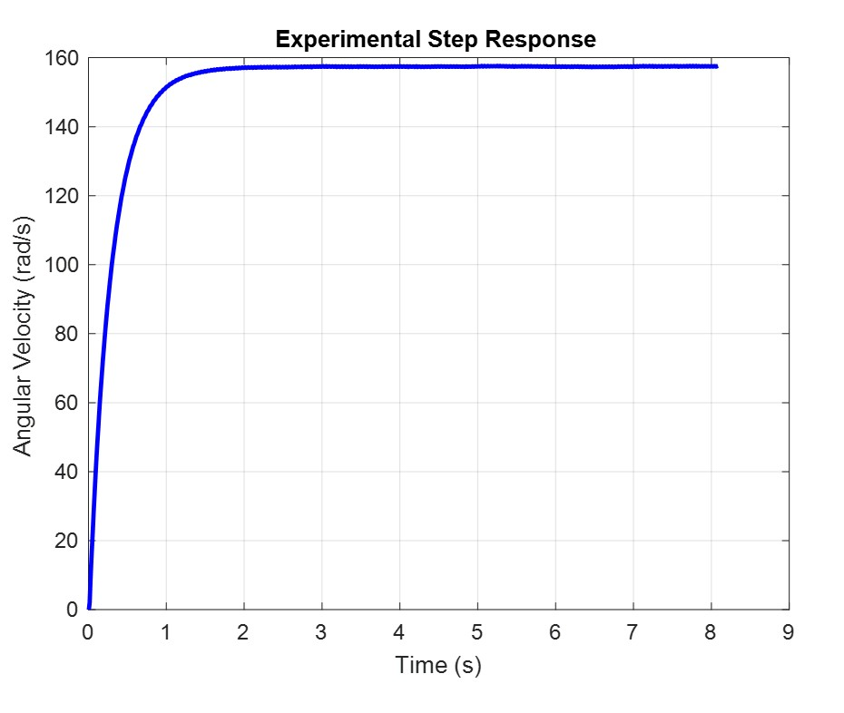<br><sub>12 V step response</sub></td>
    <td align="center" width="50%">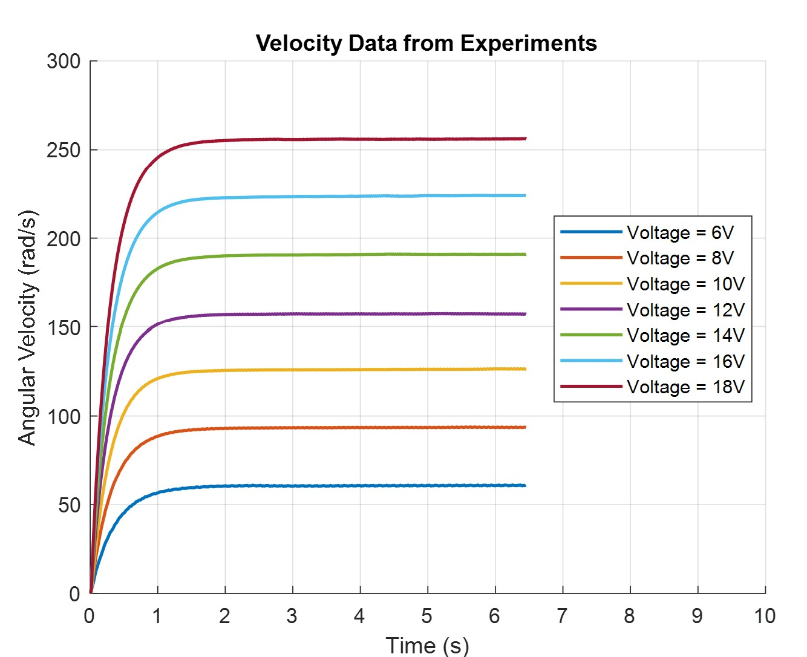<br><sub>Multiple voltage step responses</sub></td>
  </tr>
  <tr>
    <td align="center" width="50%">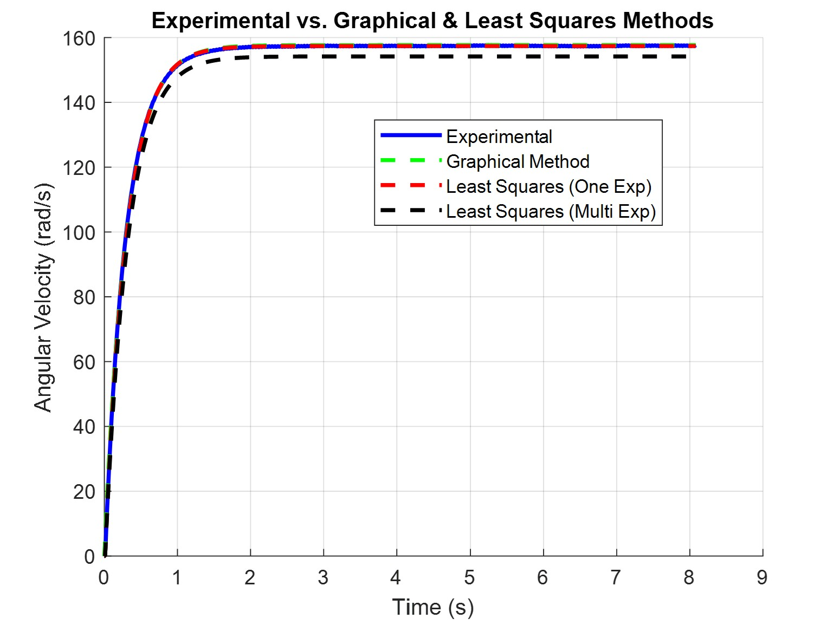<br><sub>Experimental response vs. identified models</sub></td>
    <td align="center" width="50%">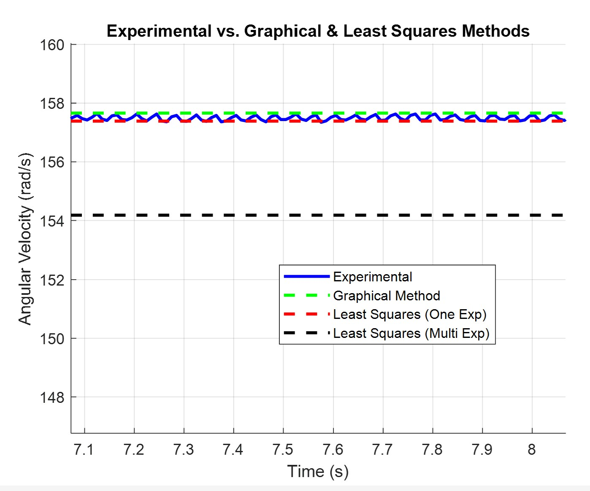<br><sub>Steady-state comparison</sub></td>
  </tr>
  <tr>
    <td align="center" width="50%">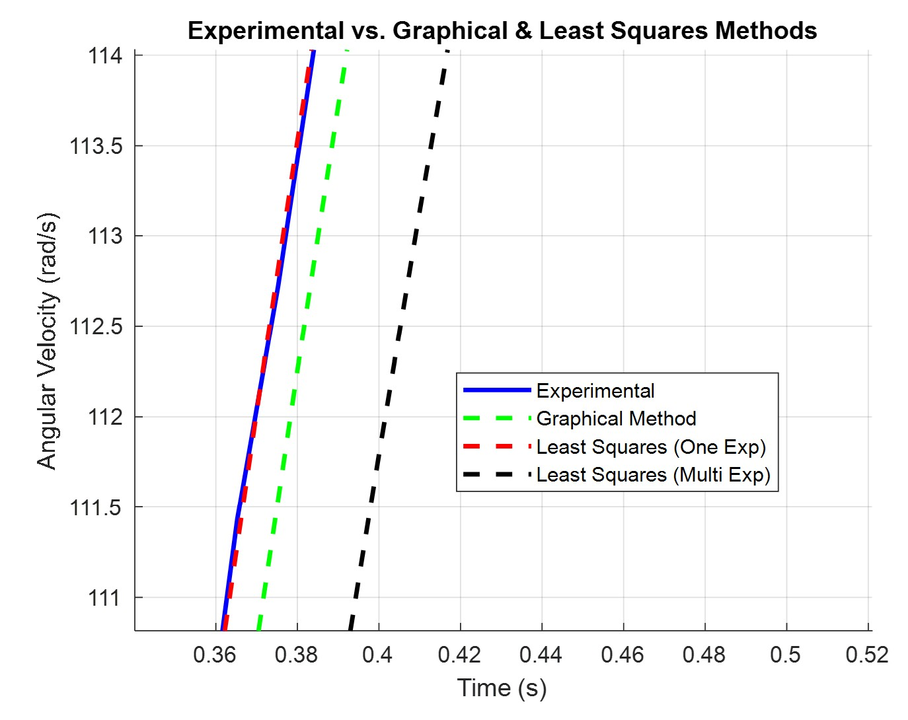<br><sub>Transient comparison</sub></td>
    <td align="center" width="50%">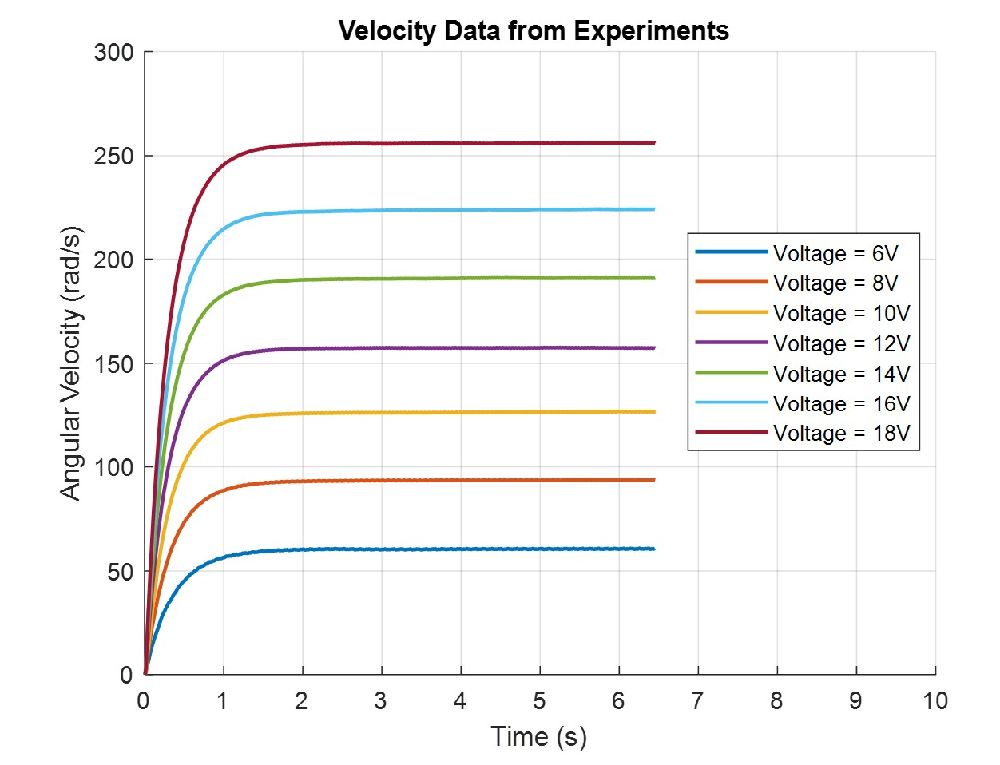<br><sub>Multiple voltage step responses, alternate view</sub></td>
  </tr>
</table>

## Controller Models

The repository also includes Simulink controller models developed for the DC motor platform, including DI feedback and LQR implementations.

<p align="center">
  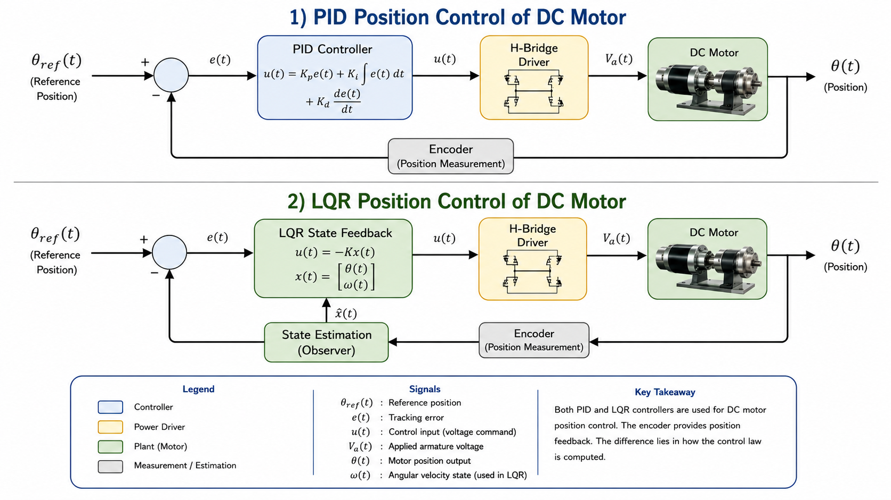
</p>

<table>
  <tr>
    <td align="center" width="33%">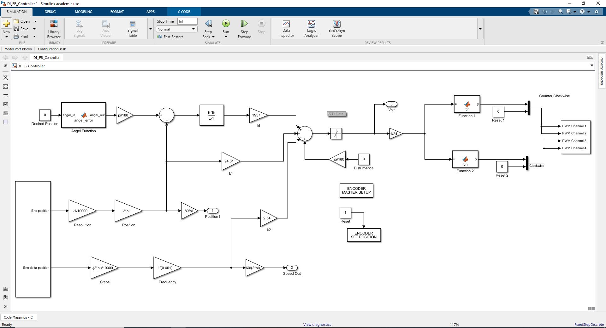<br><sub>DI feedback controller</sub></td>
    <td align="center" width="33%">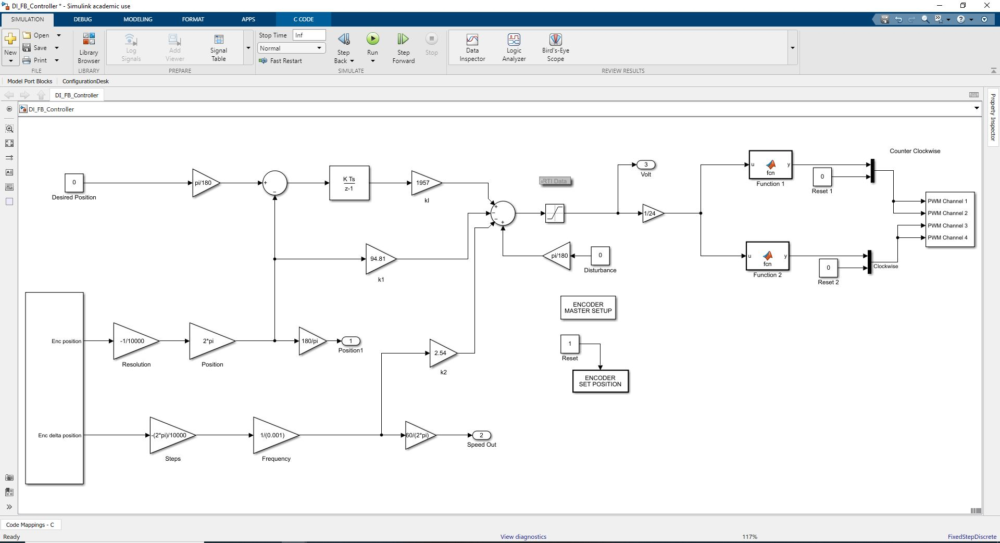<br><sub>DI feedback controller, no filter</sub></td>
    <td align="center" width="33%">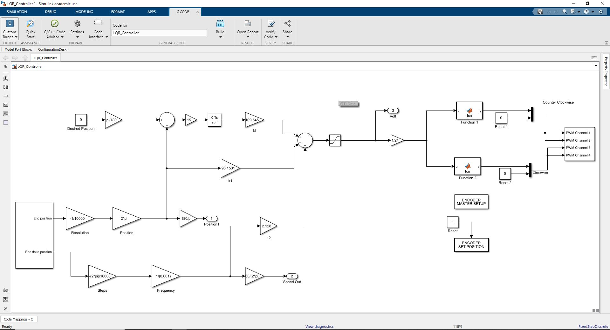<br><sub>LQR controller</sub></td>
  </tr>
</table>

## Repository Contents

```text
models/                 Simulink source models
src/user_code/          User C and makefile hooks used by generated builds
generated/rti1104/      RTI1104 generated C code and build folders
generated/deployment/   dSPACE deployment outputs, maps, SDF, PPC, TRC, and cache files
dspace/DC_MC/           dSPACE ControlDesk project, layouts, variables, and recordings
data/di_feedback/       MATLAB experiment data for DI feedback tests
data/lqr/               MATLAB experiment data for LQR tests
media/                  README figures, report figures, and Simulink screenshots
```

## Requirements

- MATLAB and Simulink
- dSPACE RTI / RTI1104 support
- dSPACE ControlDesk
- DS1104 rapid-control-prototyping hardware
- DC motor experimental setup matching the model I/O configuration

The generated files are tied to the original MATLAB, Simulink, dSPACE, and DS1104 toolchain. If you rebuild with a different release, regenerate the deployment artifacts from the Simulink models.

## Quick Start

Open the Simulink models from MATLAB:

```matlab
open_system('models/Base_Model.slx')
open_system('models/DI_FB_Controller.slx')
open_system('models/LQR_Controller.slx')
```

Open the dSPACE ControlDesk project:

```text
dspace/DC_MC/DC_MC.CDP
```

Recorded experiment data is available in:

```text
dspace/DC_MC/DI_FeedBack/Measurement Data/
dspace/DC_MC/LQR_Controller/Measurement Data/
data/di_feedback/
data/lqr/
```

## Notes

- Keep `models/` as the source of truth for Simulink development.
- Treat `generated/` as reproducible deployment output from the MATLAB/dSPACE build process.
- ControlDesk layouts and recorded measurements are kept under `dspace/` so the hardware experiment package remains self-contained.
- Verify the motor setup, encoder scaling, controller gains, I/O channels, and emergency stop procedure before running on hardware.

## Author

| Author | Profiles |
| --- | --- |
| Mohamed H. Abdullah | [](https://orcid.org/0009-0006-9253-5994) [](https://scholar.google.com/citations?hl=en&user=ynpcFeQAAAAJ&view_op=list_works&sortby=pubdate) |

## License

This project is released under the BSD-3-Clause License. See [LICENSE](LICENSE) for details.
